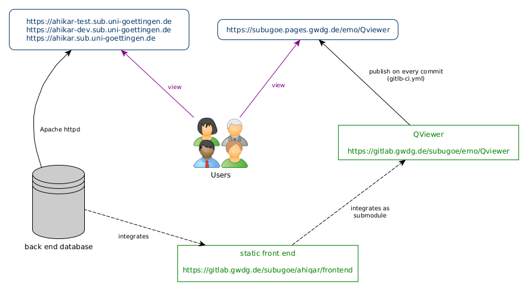

# EMo Viewer

Viewer for the modular framework to present digital editions.

**Note:**
Although the EMo Viewer is designed as a generic viewer for digital editions, it is currently developed within the scope of the [Ahiqar project](https://gitlab.gwdg.de/subugoe/ahiqar).
This is the reason for "Ahiqar" being mentioned several times in the docs of this repo.

Demo: <https://subugoe.pages.gwdg.de/emo/Qviewer/develop>

(For newer branches the demo is deployed in a directory named with branch name lowercased, shortened to 63 bytes, and with everything except `0-9` and `a-z` replaced with `-` (CI_COMMIT_REF_SLUG).
Also the commit short hash can be used to see a demo.

<!-- START doctoc generated TOC please keep comment here to allow auto update -->
<!-- DON'T EDIT THIS SECTION, INSTEAD RE-RUN doctoc TO UPDATE -->
**Overview:**

- [Getting Started](#getting-started)
  - [Prerequisites](#prerequisites)
  - [Installing](#installing)
  - [Get the Dependencies](#get-the-dependencies)
  - [Start the App in Development Mode (Hot-Code Reloading, Error Reporting, etc.)](#start-the-app-in-development-mode-hot-code-reloading-error-reporting-etc)
  - [Lint the files](#lint-the-files)
  - [Build the App for Production](#build-the-app-for-production)
  - [Customize the Configuration](#customize-the-configuration)
- [Dockerfile](#dockerfile)
- [Connecting the Viewer with a Backend](#connecting-the-viewer-with-a-backend)
- [Integration](#integration)
  - [Standalone](#standalone)
    - [As a GitLab page](#as-a-gitlab-page)
    - [By using Apache](#by-using-apache)
    - [Sample integration in the Ahikar project](#sample-integration-in-the-ahikar-project)
  - [Embedded in a website](#embedded-in-a-website)
- [Architecture](#architecture)
- [Contributing](#contributing)
- [Versioning](#versioning)
- [Authors](#authors)

<!-- END doctoc generated TOC please keep comment here to allow auto update -->

## Getting Started

### Prerequisites

To get the EMo Viewer up and running you should have the following software installed:

- npm
- vue-cli (globally installed)
- vue-cli-service-global (globally installed)

For using the development mode you also need

- quasar-cli (globally installed)

To get all dependencies via `npm`, simply run

```bash
npm install -g @vue/cli @vue/cli-service-global @quasar/cli
```

### Installing

### Get the Dependencies

```bash
npm install
```

### Start the App in Development Mode (Hot-Code Reloading, Error Reporting, etc.)

```bash
quasar dev
```

### Lint the files

```bash
npm run lint
```

### Build the App for Production

```bash
quasar build
```

### Customize the Configuration

See [Configuring quasar.conf.js](https://quasar.dev/quasar-cli/quasar-conf-js).

## Dockerfile

The dockerfile is used at GitLab CI.
It needs to be updated, when either node or quasar-cli should be updated.

```bash
docker build --pull -t docker.gitlab.gwdg.de/subugoe/emo/qviewer/node .
docker push docker.gitlab.gwdg.de/subugoe/emo/qviewer/node
```

## Connecting the Viewer with a Backend

The viewer expects JSON that complies to the [SUB's generic TextAPI](https://subugoe.pages.gwdg.de/emo/text-api/) in order to function properly.
To establish a link to the backend, the viewer's entrypoint in `src/index.template.html` has to be modified:

```html
"entrypoint": "https://{server}{/prefix}/{collection}/collection.json"
```

The entrypoint should point to the collection you want to be displayed.

## Integration

### Standalone

#### As a GitLab page

In order to use the QViewer in combination with GitLab pages you can keep to the following steps:

1. Fork this repository
2. Make sure you have CI/CD and GitLab pages enabled in your new project.
You can set it up at `Settings > General > Visibility, project features, permissions`.
Tick the boxes labelled `Pipeline` and `Pages`.
3. @@TODO

#### By using Apache

In case you have a server with `apache2` installed you can simply copy the QViewer's into your preferred and configured
Apache directory for exposing it to the web e.g. `/usr/local/apache2/htdocs/frontend`.

#### Sample integration in the Ahikar project



### Embedded in a website

@@TODO

## Architecture


## Contributing

Please read [CONTRIBUTING.md](CONTRIBUTING.md) for details on our code of conduct, and the process for submitting pull requests to us.

## Versioning

We use [SemVer](https://semver.org/) for versioning. For the versions available, see the [tags on this repository](https://gitlab.gwdg.de/subugoe/emo/Qviewer/-/tags).

## Authors

See the list of [contributors](https://gitlab.gwdg.de/subugoe/emo/Qviewer/-/graphs/develop) who participated in this project.
