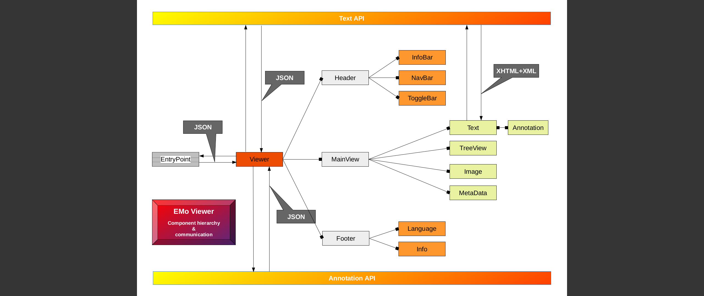
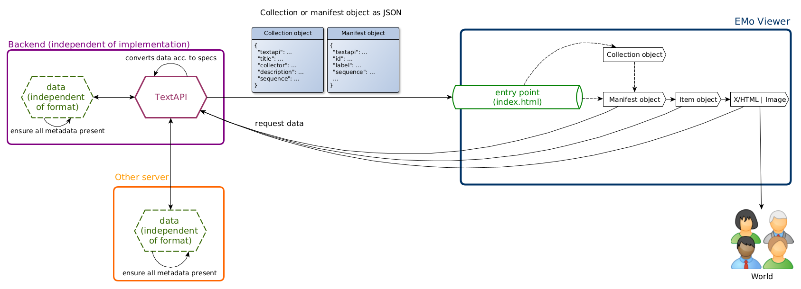

# TIDO

Text vIewer for Digital Objects.

**Note:**
Although TIDO is designed as a generic viewer for digital editions, it is currently developed within the scope of the [Ahiqar project](https://gitlab.gwdg.de/subugoe/ahiqar).

This is the reason for "Ahiqar" being mentioned several times in the docs of this repo.

Demo: <https://subugoe.pages.gwdg.de/emo/Qviewer/develop>

(For newer branches the demo is deployed in a directory named with branch name lowercased, shortened to 63 bytes, and with everything except `0-9` and `a-z` replaced with `-` (CI_COMMIT_REF_SLUG).
Also the commit short hash can be used to see a demo.

## Overview

<!-- START doctoc generated TOC please keep comment here to allow auto update -->
<!-- DON'T EDIT THIS SECTION, INSTEAD RE-RUN doctoc TO UPDATE -->

- [Latest Version and Integration](#latest-version-and-integration)
  - [A) Installation via npm](#a-installation-via-npm)
    - [Prerequisite: Access Token](#prerequisite-access-token)
    - [Authentication](#authentication)
    - [Registry setup](#registry-setup)
    - [Installation](#installation)
  - [B) Download the bundle](#b-download-the-bundle)
  - [Integration](#integration)
- [Getting Started (Developers)](#getting-started-developers)
  - [Prerequisites](#prerequisites)
  - [Environment setup](#environment-setup)
    - [Set up `nvm` and the recent stable version of `node.js`](#set-up-nvm-and-the-recent-stable-version-of-nodejs)
    - [Set up `global` project requirements via `npm`](#set-up-global-project-requirements-via-npm)
    - [Clone the repository](#clone-the-repository)
    - [Get the dependencies](#get-the-dependencies)
  - [Usage](#usage)
    - [`development mode` (hot reloading, error reporting, etc.)](#development-mode-hot-reloading-error-reporting-etc)
    - [`Linting`](#linting)
    - [`Testing`](#testing)
    - [`Building` the app for production](#building-the-app-for-production)
- [Configuration](#configuration)
  - [a) Configure the Viewer](#a-configure-the-viewer)
    - [The Keys in Detail](#the-keys-in-detail)
  - [b) Configure the Panels](#b-configure-the-panels)
    - [The Panel Keys in Detail](#the-panel-keys-in-detail)
- [Viewer Components](#viewer-components)
- [Dockerfile](#dockerfile)
- [Connecting the Viewer to a Backend](#connecting-the-viewer-to-a-backend)
- [Architecture](#architecture)
- [Contributing](#contributing)
- [Versioning](#versioning)
- [Authors](#authors)

<!-- END doctoc generated TOC please keep comment here to allow auto update -->

## Latest Version and Integration

There are two options - **A)** and **B)** - to get the Viewer depending on it's usage.

Please follow these steps to include it for production:

### A) Installation via npm

#### Prerequisite: Access Token

**Note**: if you don't have an **Access Token**, please head over to the GitLab page and create it:
[Create personal access token](https://gitlab.gwdg.de/-/profile/personal_access_tokens)
(otherwise you can skip this step).

Enter an arbitrary **name** and tick the **api** box under **scopes**. Click **Create personal access token** hereafter.

#### Authentication

To authenticate, configure **npm** accordingly:

```bash
npm config set '//gitlab.gwdg.de/api/v4/packages/npm/:_authToken' "$AUTH_TOKEN"
```

**Note**: replace $AUTH_TOKEN with your valid Auth-Token (that you - maybe - just created before).

#### Registry setup

Since npm communicates with the package api, it's necessary to setup a valid entrypoint.

Set it up with the following command:

```bash
echo @subugoe:registry=https://gitlab.gwdg.de/api/v4/packages/npm/ >>.npmrc
```

**Note**: fire this command inside the **root** of your **project directory**.

#### Installation

```bash
npm i @subugoe/tido
```

### B) Download the bundle

As an **alternative** to the npm package you can download the artifact: [get the latest compiled and minified version](https://gitlab.gwdg.de/subugoe/emo/Qviewer/-/jobs/artifacts/develop/download?job=build_main_and_develop)

It is a zip archive. Extract the downloaded build by typing:

```bash
unzip artifacts.zip
```

This creates the following folder structure:

```bash
dist/
├── index.html
└── tido.js
```

### Integration

The integration depends on the option you chose from above; e.g. installation via npm or rather bundle download.

**A)** If you installed *TIDO* with **npm**, add this line to your **main.js** file:

```js
import '@subugoe/tido/dist/tido'
```

**Note**: `main.js` serves as your *entrypoint* usually located at **/[projectdir]/src/main.js**. It depends on your individual project setup.

**B)** If you **downloaded** *TIDO* as a **bundle**, reference the js file accordingly at the end of the body tag inside your **index.html** file:

```html
<script src="dist/tido.js"></script>
```

**Finally** copy the config object into your entrypoint file (usually **index.html**):

```html
<body>
  ...

  <noscript>
    <strong>We're sorry but TIDO doesn't work properly without JavaScript enabled.
      Please enable it to continue.
    </strong>
  </noscript>

  <script id="tido-config" type="application/json">
  {
    "entrypoint": "",
    "colors": {
      "primary": "",
      "secondary": "",
      "accent": ""
    },
    "headers": {
      "all": true,
      "info": true,
      "navigation": true,
      "toggle": true
    },
    "labels": {
      "item": "Sheet",
      "manifest": "Manuscript"
    },
    "meta": {
      "collection": {
        "all": true,
        "collector": true,
        "description": true,
        "title": true
      },
      "manifest": {
        "all": true,
        "creation": true,
        "editor": true,
        "label": true,
        "location": true,
        "origin": true
      },
      "item": {
        "all": true,
        "label": true,
        "language": true
      }
    },
    "standalone": true
  }
  </script>

  <div id="q-app"></div>
</body>

```

**Note**: Please make sure to provide a valid *entrypoint* that points to the manifest / collection that you want to be displayed.

## Getting Started (Developers)

### Prerequisites

To get TIDO up and running you should have the following software installed:

- **curl**
- **npm**
- **nvm**

**Note**:

We recommend to make use of `nvm`, since there might be issues with npm regarding permissions.  
The main purpose of `nvm` is to have multiple node versions installed in regards to different projects which might demand some sort of backwards compatibility.  
It enables you to just switch to the appropriate node version.  
Besides it also keeps track of resolving permission issues, since all your global installations go to your home directory (~/.nvm/) instead of being applied systemwide.

### Environment setup

#### Set up `nvm` and the recent stable version of `node.js`

```bash
curl -o- https://raw.githubusercontent.com/nvm-sh/nvm/v0.35.3/install.sh | bash
nvm install stable
```

**Note**:
After the nvm installation is done, please `restart` your shell session once. That's due to changes to your profile environment.

#### Set up `global` project requirements via `npm`

```bash
npm install -g @vue/cli @vue/cli-service-global @quasar/cli
```

#### Clone the repository

```bash
git clone git@gitlab.gwdg.de:subugoe/emo/Qviewer.git
```

#### Get the dependencies

Head over to your project directory, where you just cloned the repository to as described above and get all the dependencies needed by typing:

```bash
cd /path/to/projectdir
npm install
```

That's it. You should now be able to run the Viewer.

### Usage

#### `development mode` (hot reloading, error reporting, etc.)

```bash
npm run dev
```

(usually located at: `localhost:8080` since this port isn't already occupied)

#### `Linting`

```bash
npm run lint            # to lint js- and vue-files
npm run lint:scss       # to lint the styles
npm run lint:markdown   # to lint the markdown
```

#### `Testing`

```bash
npm run test:unit
```

The Viewer makes use of **jest** in collaboration with the *expect-library*.  
Tests reside under **tests/unit/specs/** and are supposed to have a file ending of either `*.test.js` or `*.spec.js`.

#### `Building` the app for production

```bash
npm run build
```

**Note**: The complete build is located at `/dist/spa/`.

## Configuration

The Viewer is build with **Vue.js** and **Quasar**.
If you want to change the Quasar configuration, please [refer to their respective docs](https://quasar.dev/quasar-cli/quasar-conf-js) (Configuring quasar.conf.js).

There are two files in regards to configuration:

- a) configure the Viewer (**src/index.template.html**)
  - change the color scheme
  - show or hide individual bars (info, navigation, toggles)
  - rename labels
  - usage (standalone / embedded)

- b) configure the panels (**src/config/panels.js**)
  - set the order of the panels
  - group the components inside a panel (e.g. turn them into tabs)
  - rename the panel headings
  - switch the panel/s off

### a) Configure the Viewer

Locate the `script` section in the `index.template.html` file:

As a rule of thumb, every key with a boolean value (e.g. *true* or *false*) defaults to `true` and denotes to show the appropriate component.

```html
  <script id="tido-config" type="application/json">
  {
    "entrypoint": "https://{server}{/prefix}/{collection}/collection.json",
    "colors": {
      "primary": "",
      "secondary": "grey",
      "accent": "darkred"
    },
    "headers": {
      "all": true,
      "info": true,
      "navigation": true,
      "toggle": true
    },
    "labels": {
      "item": "Sheet",
      "manifest": "Manuscript"
    },
    "meta": {
      "collection": {
        "all": true,
        "collector": true,
        "description": true,
        "title": true
      },
      "manifest": {
        "all": true,
        "creation": true,
        "editor": true,
        "label": true,
        "location": true,
        "origin": true
      },
      "item": {
        "all": true,
        "label": true,
        "language": true
      }
    },
    "standalone": true
  }
</script>
```

**Note**:

It's a *JSON* object. So if you are going to make any changes and you have to quote these (see *labels* or *colors*), please use *double quotes* only.

#### The Keys in Detail

- **entrypoint**

  to link the viewer to a backend, the entrypoint should point to the collection you want to be displayed.
  (Further details below: [Connecting the Viewer to a Backend](#connecting-the-viewer-to-a-backend))

  **Note**:

  You have to provide at least a valid entrypoint (see below). Otherwise the Viewer won't show anything at all!

- **colors**

  Set the colors used in the frontend.

  `primary` and `accent` should be a darker tone, so that white text is visible if used as background. It's the other way around with `secondary`.

  Hex values (like `#a1a1a1`) or color names (like `hotpink`) are fine.

  If any value is left blank (e.g. `"primary": "",`), a default color scheme will be used.

- **headers**

  - **all**

    set this value to `false` if you want to completely switch off all the headerbars at once.  
    This value takes **precedence** over the other *header-keys*.  
    If it is set to `false`, the other settings for the individual bars are not taken into account.

    *(A use case might be to embed the Viewer into an existing website and you simply need more screen space)*

  - **info**

    set this value to `false` if you want to switch off the Infobar (a.k.a. breadcrumbs)  

  - **navigation**

    set this value to `false` if you want to switch off the NavBar

  - **toggle**

    set this value to `false` if you want to switch off the ToggleBar.

    **Note**:

    if you turn this one off, you won't be able to toggle the panels anymore.

    All header values default to `true`.

- **labels**

  - **item**:

    The label of the item respectively  
    Assuming your collection consists of letters, you'd maybe want to name it "letter" or just "sheet" for instance.  
    This change affects the captions of the navbuttons located in the headerbar and the metadata section.  
    Defaults to `Sheet`.

  - **manifest**:

    Same as for `item` but related to the manifest title.  
    Defaults to `Manuscript`.

- **meta**

  set either of the values to `false` to switch it off. if you set an `all`-key to `false` the other fields within the same object aren't taken into account.

  e.g. neither of *collector*, *description* and *title* will be displayed:

  ```json
  "meta": {
    "collection": {
      "all": false,
      "collector": true,
      "description": true,
      "title": true
    }
  }
  ```

- **standalone**

  denotes if the Viewer will be used as a single page application or if it will be embedded into an existing page. If you want to use it in the latter case, please toggle the value to "false". That way the language toggle in the footer section will not show up.

  Defaults to `true`.

  **rtl**

  this option supports text to be displayed from right to left inside the text panel (e.g. arabic).
  set this value to `false` if you want to disable it or rather if you want to display text which is read from left to right (e.g. english).

  Defaults to `true`.

### b) Configure the Panels

In order to configure the panels, locate the `panels.js` file inside the `src/config` folder of your project dir and find the *panels* constant at the top of the file:

```js
  const panels = [
    {
      id: uuidv4(),
      connector: [1, 2],
      panel_label: 'Tabs',
      show: true,
    },
    {
      id: uuidv4(),
      connector: [3],
      panel_label: 'Image',
      show: true,
    },
    {
      id: uuidv4(),
      connector: [4],
      panel_label: 'Text',
      show: true,
    },
    {
      id: uuidv4(),
      connector: [5],
      panel_label: 'Annotations',
      show: true,
    },
  ];
```

It consists of four objects according to the maximum number of panels, that can be shown at once.  
Each object inside that constant consists of similar keys: `id`, `connector`, `pane_label` and `show`.

#### The Panel Keys in Detail

- **id**

  provides unique IDs. (**Note**: please leave this value untouched; it's meant for internal use only!)

- **connector**

  references the component id/s according to the appropriate panel/s or rather tab/s:

  - 1 = Treeview
  - 2 = Metadata
  - 3 = OpenSeadragon
  - 4 = Content / Text
  - 5 = Annotations

  **Note**:

  These IDs are supposed to be *unique*, so please make sure not to repeat these!

- **panel_label**

  refers to the heading in each panel's *toolbar* (**Note**: Please make sure to also change the name, if you are going to reorder the panels or turn them into tabs.)

- **show**

  toggles (`show` or rather `hide`) the appropriate panel respectively

**Note**:

Modifying the *connector* and the *panel_label* works on user configuration as well.

Example given:

Assuming you want to combine the *Metadata*, *Text* and *Annotations* panels:

```js
  {
    id: uuidv4(),
    connector: [2, 4, 5],
    panel_label: 'Meta, Text & Anno',
    show: true
  }
```

To rename a panel heading, change the corresponding `panel_label` according to your needs.  
If you intend to hide a component, just toggle its corresponding *show-key* to `false`.

## Viewer Components



## Dockerfile

The dockerfile is used for GitLab CI.  
It needs to be updated when either `node` or `quasar-cli` should be updated.

```bash
docker build --pull -t docker.gitlab.gwdg.de/subugoe/emo/qviewer/node .
docker push docker.gitlab.gwdg.de/subugoe/emo/qviewer/node
```

## Connecting the Viewer to a Backend

The viewer expects JSON that complies to the [SUB's generic TextAPI](https://subugoe.pages.gwdg.de/emo/text-api/) in order to function properly.  
To establish a link to the backend, the viewer's entrypoint in `src/index.template.html` has to be modified:

```html
"entrypoint": "https://{server}{/prefix}/{collection}/collection.json"
```

The entrypoint should point to the collection you want to be displayed.

## Architecture



## Contributing

Please read [CONTRIBUTING.md](CONTRIBUTING.md) for details on our code of conduct, and the process for submitting pull requests to us.

## Versioning

We use [SemVer](https://semver.org/) for versioning. For the versions available, see the [tags on this repository](https://gitlab.gwdg.de/subugoe/emo/Qviewer/-/tags).

## Authors

See the list of [contributors](https://gitlab.gwdg.de/subugoe/emo/Qviewer/-/graphs/develop) who participated in this project.
